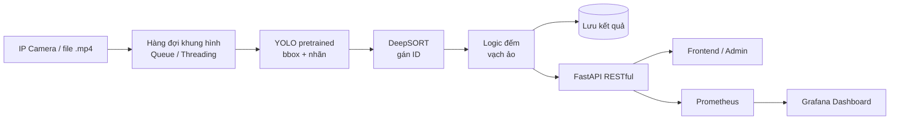
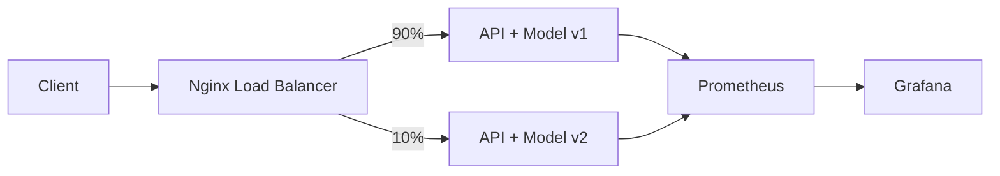
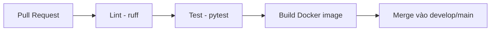

# Kiến trúc hệ thống

## Luồng xử lý

```mermaid
flowchart LR
    CAM[IP Camera / file .mp4] --> Q[Hàng đợi khung hình<br/>Queue / Threading]
    Q --> YOLO[YOLO pretrained<br/>bbox + nhãn]
    YOLO --> DS[DeepSORT<br/>gán ID]
    DS --> CNT[Logic đếm<br/>vạch ảo]
    CNT --> DB[(Lưu kết quả)]
    CNT --> API[FastAPI RESTful]
    API --> FE[Frontend / Admin]
    API --> PROM[Prometheus]
    PROM --> GRAF[Grafana Dashboard]
```

## Triển khai và Canary

```mermaid
flowchart LR
    U[Client] --> NG[Nginx Load Balancer]
    NG -- "90%" --> V1[API + Model v1]
    NG -- "10%" --> V2[API + Model v2]
    V1 --> PROM[Prometheus]
    V2 --> PROM
    PROM --> GRAF[Grafana]
```

Tỷ lệ chia traffic cấu hình trong `nginx/nginx.conf` (tham số `weight`).

## CI/CD

```mermaid
flowchart LR
    PR[Pull Request] --> LINT[Lint - ruff]
    LINT --> TEST[Test - pytest]
    TEST --> BUILD[Build Docker image]
    BUILD --> MERGE[Merge vào develop/main]
```
